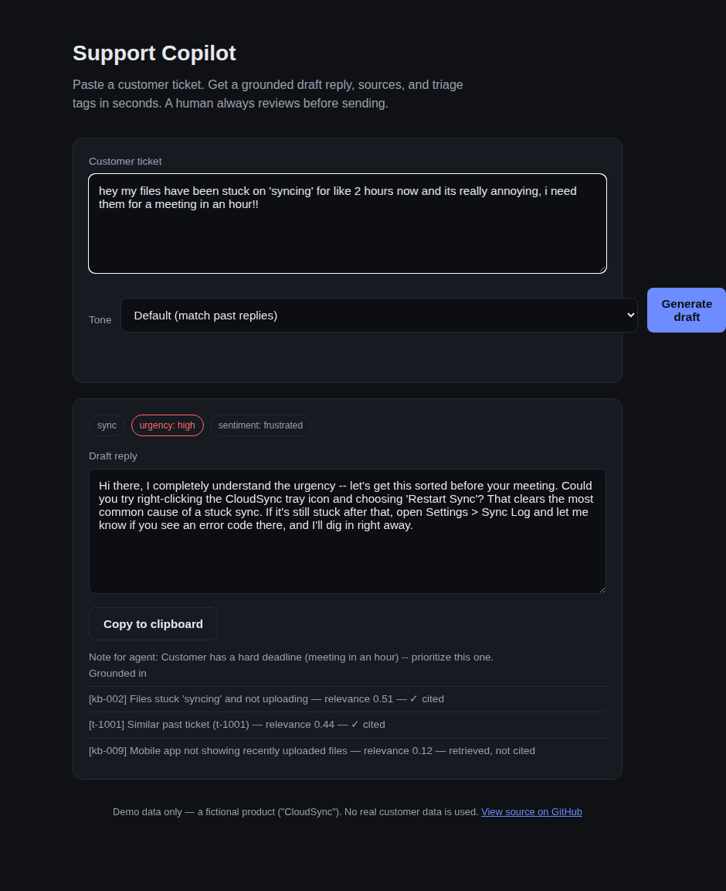

# Support Copilot

A small, working clone of the "AI copilot" feature inside tools like Zendesk Copilot, Intercom Copilot, and Help Scout AI Drafts: paste a customer support ticket, get back a **grounded, cited draft reply** plus **triage tags** (urgency / sentiment / category), in one call to Claude. A human agent always reviews the draft before it goes out — this assists agents, it doesn't replace them.



## Why this exists

I work in support and wanted to understand, hands-on, how the AI-copilot products my team evaluates (and that companies pay $30–50/agent/month for) actually work under the hood — retrieval, grounding, prompt design, and the "draft, don't auto-send" pattern that makes these tools trustworthy enough to use on real customers. This is that: a minimal but complete version, built to run locally in a few minutes.

## What it does

1. **Retrieves relevant context.** A TF-IDF search over a knowledge base and past resolved tickets finds the articles/examples most relevant to the incoming ticket — no vector DB or embeddings API required to run it.
2. **Drafts a grounded reply.** Claude drafts a reply using *only* the retrieved context, and is instructed to flag in `notes_for_agent` when the context doesn't cover something, instead of guessing. Sources actually used are cited back to the agent.
3. **Tags the ticket.** The same call returns urgency, sentiment, and category — the "triage" half of what these tools do — so it's one request, not two.
4. **Leaves the human in control.** Nothing sends automatically. The agent reviews, edits, and sends.

## Quick start

```bash
git clone <this-repo>
cd support-copilot
pip install -r requirements.txt
cp .env.example .env   # add your ANTHROPIC_API_KEY
uvicorn app.main:app --reload
```

Open `http://localhost:8000`, paste a ticket (try one of the examples below), and click **Generate draft**.

Try:
- *"hey my files have been stuck on 'syncing' for 2 hours, I need them for a meeting in an hour!!"*
- *"I was charged twice this month, can I get one refunded?"*
- *"lost my phone with my authenticator app, now I can't log in because of 2FA"*

## Running the tests

```bash
pip install pytest
pytest
```

Tests cover the retrieval layer (no API key needed) — it's the part with actual logic worth testing; the drafting layer is a thin, mockable wrapper around one API call.

## Architecture

```
customer ticket text
        │
        ▼
 retrieval.py  ──►  TF-IDF search over knowledge_base.json + past_tickets.json
        │                (top-k most relevant articles / past replies)
        ▼
 drafting.py   ──►  one Claude API call: draft reply + citations + triage tags,
        │                grounded in the retrieved context only
        ▼
   FastAPI (main.py)  ──►  JSON response  ──►  simple web UI (static/)
```

- `app/retrieval.py` — TF-IDF + cosine similarity search. Deliberately dependency-light (scikit-learn only, no vector DB) so the whole project runs with nothing but an API key. See the docstring for when you'd want to swap in real embeddings.
- `app/drafting.py` — builds the grounding prompt, calls Claude, parses structured JSON output (draft + sources + tags), fails soft if the model doesn't return clean JSON.
- `app/main.py` — FastAPI app: `POST /api/draft` is the only real endpoint.
- `app/data/` — synthetic demo data for a fictional product ("CloudSync", a file sync/backup app) — no real customer data anywhere in this repo.
- `app/static/` — a small vanilla HTML/CSS/JS frontend. No build step, no framework, so anyone can clone and run it in under a minute.

## What I'd build next

- **Real helpdesk integration** — pull tickets from Zendesk/Freshdesk/Intercom via their APIs instead of pasted text, and push the draft back as an internal note.
- **Feedback loop** — track edit distance between the draft and what the agent actually sent, to measure draft quality over time and flag categories where the model needs better context.
- **Embeddings-based retrieval** — once the knowledge base grows past a few hundred articles, TF-IDF starts missing paraphrases; swap in a proper embedding model.
- **Multi-turn context** — ground on the full ticket thread, not just the latest message.

## Notes on the demo data

Everything in `app/data/` is synthetic, written for this project, describing a fictional product called "CloudSync." No real employer or customer data is included anywhere in this repository.

## License

MIT — see [LICENSE](LICENSE).
